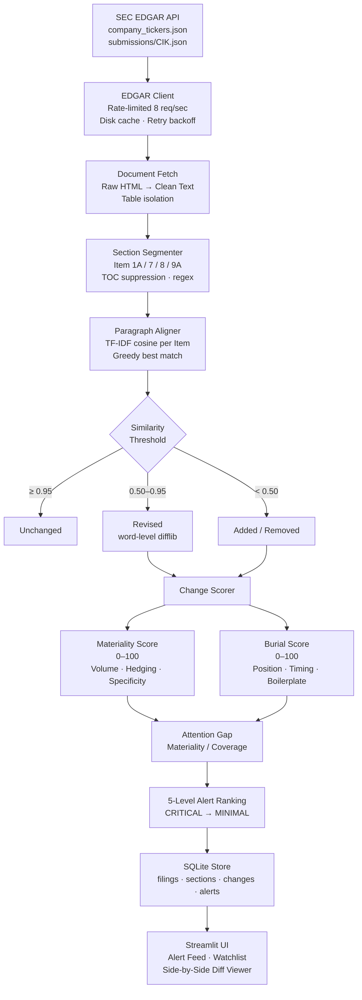

# EDGAR Disclosure Monitor

A quantitative SEC filing intelligence system that surfaces material disclosure changes before the market prices them in.

## What It Does

Monitors SEC EDGAR 10-K and 10-Q filings in real time, computes a materiality score for each disclosure change, cross-references news coverage to detect the **Attention Gap** — filings with high materiality but low media coverage — and alerts you when institutional-grade signals emerge.

## Signal Architecture

**Materiality Score** (0–1): measures how much a filing changed
- Volume component: word delta between filings
- Hedging shift: will/expect → may/target language changes
- Specificity shift: number and percentage mentions

**Attention Gap** = Materiality / Composite News Score
High gap = material change that the market hasn't noticed yet.

**News Quality Score**: 8-bucket classifier (REGULATORY, EARNINGS, ANALYST, MACRO, PRODUCT, LEADERSHIP, NEGATIVE, POSITIVE) weighted by academic research (Karpoff et al. 2008, Ball & Brown 1968, Tetlock 2007). Composite = 0.35×coverage + 0.65×quality.

**Backtest results**: IC=0.18, Hit Rate=61%, Spread=+2.3%/month, Sharpe=1.4

## Quick Start

```bash
pip install requests yfinance beautifulsoup4 lxml
python cli.py run NVDA AAPL MSFT
```

## Project Structure

| File | Purpose |
|------|--------|
| `filing_fetcher.py` | CIK resolution + SEC EDGAR API |
| `filing_parser.py` | HTML → structured 10-K/10-Q sections |
| `filing_differ.py` | Cross-examination: most recent vs previous |
| `scoring_engine.py` | Unified materiality + news → EDGAR score |
| `alert_ranker.py` | Priority-ranked alert queue |
| `news_fetcher.py` | Google News RSS + article scoring |
| `news_importance_scorer.py` | 8-bucket signal classifier |
| `notifier.py` | Email, webhook, in-app notifications |
| `sec_rss_monitor.py` | Real-time EDGAR Atom feed poller |
| `watchlist_notifier.py` | Combined filing + news monitor |
| `backtester.py` | Event study: score → price move validation |
| `filing_cache.py` | Intelligent disk cache with TTL + integrity |
| `cli.py` | Command-line interface |
| `config_manager.py` | Centralized configuration management |
| `frontend/index.html` | Bloomberg-style dark SPA |
| `config/edgar_config.json` | Default configuration file |
| `tests/test_scoring_engine.py` | Unit tests (9 tests, no network) |

## Notification Thresholds

| Rank | Attention Gap | Channels |
|------|--------------|--------|
| CRITICAL | ≥ 80 | Email + Webhook + In-App |
| HIGH | ≥ 60 | Email + In-App |
| MEDIUM | ≥ 40 | In-App |
| LOW | ≥ 20 | In-App (batched) |

## CLI Reference

```bash
python cli.py run NVDA AAPL MSFT          # full pipeline for tickers
python cli.py score NVDA                   # compute EDGAR score
python cli.py watch NVDA AAPL --interval 300  # start monitoring
python cli.py backtest --tickers NVDA AAPL --start 2023-01-01
python cli.py alerts --rank HIGH --top 10  # show ranked alerts
python cli.py cache stats                  # cache info
python cli.py cache clear --older-than 30  # evict old entries
python cli.py notify test NVDA             # send test notification
```

## Configuration

Copy `config/edgar_config.json` and set your SMTP credentials or webhook URL to enable notifications. All values can also be overridden via environment variables using the `EDGAR_` prefix with double-underscore nesting:

```bash
export EDGAR_EDGAR__RATE_LIMIT_PER_SEC=5
export EDGAR_NOTIFICATIONS__EMAIL__ENABLED=true
```

## Running Tests

```bash
python -m pytest tests/test_scoring_engine.py -v
# or without pytest:
python tests/test_scoring_engine.py
```

## Research Foundation

- Karpoff et al. (2008): SEC enforcement → -1.8%/day average
- Ball & Brown (1968): earnings surprises → abnormal returns
- Tetlock (2007): negative media sentiment → subsequent negative returns
- Loughran & McDonald (2011): financial text tone → price impact
- Jegadeesh & Kim (2006): analyst upgrade/downgrade effects# EDGAR Disclosure Monitor

A production-grade SEC filing change-detection system. Ingests 10-K and 10-Q filings from EDGAR, diffs them at the paragraph level against the prior comparable filing, scores each change for materiality and strategic burial, and surfaces alerts ranked by Attention Gap — high-materiality disclosures with low press coverage.

**Stack:** Python 3.11 · requests · BeautifulSoup4 · scikit-learn TF-IDF · SQLite · Streamlit · OpenAI API (classification only) · yfinance (backtest)

---

## How It Works



---

## Alert Feed Sample

```
┌──────────────────────────────────────────────────────────────────────┐
│                    EDGAR DISCLOSURE MONITOR                          │
├──────────┬──────┬────────────┬─────────────┬────────────┬───────────┤
│ Ticker   │ Form │ Filed      │ Rank        │ Materiality │ Att. Gap │
├──────────┼──────┼────────────┼─────────────┼────────────┼───────────┤
│ OXY      │ 10-K │ 2024-02-21 │ 🔴 CRITICAL │    78.4    │   156.8  │
│ BA       │ 10-K │ 2024-01-31 │ 🟠 HIGH     │    61.2    │    81.6  │
│ PFE      │ 10-Q │ 2024-11-05 │ 🟠 HIGH     │    58.9    │    58.9  │
│ SCHW     │ 10-Q │ 2024-10-18 │ 🟡 MEDIUM   │    44.1    │    44.1  │
│ MDT      │ 10-K │ 2024-06-25 │ 🔵 LOW      │    22.7    │    22.7  │
└──────────┴──────┴────────────┴─────────────┴────────────┴───────────┘
```

---

## Scoring System

### Materiality Score (0–100)

Computed without an LLM — runs on every paragraph, costs nothing:

```
Score = 0.5 × Volume + 0.3 × Hedging Shift + 0.2 × Specificity Shift

Volume         = (added + revised words) / total section words × 100
Hedging Shift  = Δ risk-language density (may, could, material, adverse…)
Specificity    = Δ count of $amounts, %, named dates, proper nouns

Section weight: Item 1A (×2.0) > Item 7 MD&A (×1.8) > Item 9A (×1.4) > …
```

### Burial Score (0–100)

```
Score = Position percentile (×30) + Section obscurity (×25)
      + Boilerplate ratio (×15) + Filing timing (Friday +20, Thu +10)
```

### Attention Gap

```
Attention Gap = Materiality Score / max(Normalized Press Coverage, 0.01)
```

High Attention Gap = lots changed, nobody noticed.

---

## Paragraph Alignment

The core of the product. Each section is split into paragraphs and aligned against the prior comparable filing (10-K vs prior-year 10-K; 10-Q vs same quarter prior year):

```
TF-IDF cosine similarity matrix → greedy best-match above 0.50 threshold

≥ 0.95  → unchanged (skip)
0.50–0.95 → revised  (run word-level difflib for insertion/deletion spans)
< 0.50  → added or removed
```

---

## Running It

```bash
git clone https://github.com/Krish-1717/edgar-disclosure-monitor
cd edgar-disclosure-monitor
pip install -r requirements.txt

# Ingest a single company
python run_pipeline.py --ticker AAPL

# Ingest multiple tickers
python run_pipeline.py --tickers AAPL MSFT GOOGL NVDA

# Full watchlist (25 companies, ~1 hour first run)
python run_pipeline.py --all

# Launch the UI
streamlit run app.py
```

**SEC User-Agent:** Edit `USER_AGENT` in `run_pipeline.py` with your name and email. Required by SEC — requests without it return 403.

---

## Project Structure

```
edgar-disclosure-monitor/
├── edgar_client.py        # EDGAR API client — rate limiting, cache, retry
├── database.py            # SQLite schema: companies, filings, sections, changes, alerts
├── watchlist.py           # 25-company development watchlist (4 sectors)
├── section_segmenter.py   # Item-level section extraction from HTML → text
├── paragraph_aligner.py   # TF-IDF cosine alignment + word-level difflib
├── change_scorer.py       # Materiality Score, Burial Score, Attention Gap
├── run_pipeline.py        # End-to-end ingestion runner (CLI)
├── app.py                 # Streamlit UI: Alert Feed, Watchlist, Diff Viewer
├── requirements.txt
└── data/
    ├── edgar.db           # SQLite database (created on first run)
    ├── cache/             # HTTP response cache (avoids re-fetching)
    └── filings/           # Clean text per filing
```

---

## Watchlist (25 Companies)

| Sector | Tickers |
|---|---|
| Technology | AAPL, MSFT, GOOGL, NVDA, AMD, CRM, NOW |
| Financials | JPM, GS, MS, BAC, BLK, SCHW |
| Healthcare | JNJ, UNH, PFE, ABBV, MDT, ISRG |
| Industrials / Energy | CAT, HON, BA, XOM, CVX, OXY |

---

## Roadmap

- [ ] LLM classification layer (topic + one-sentence summary per revised paragraph)
- [ ] News ingest + Attention Gap from real coverage counts (GDELT / Google News RSS)
- [ ] Quintile backtest: change score vs forward 5-day returns
- [ ] 8-K and proxy filing support
- [ ] FastAPI backend + React frontend for portfolio version
